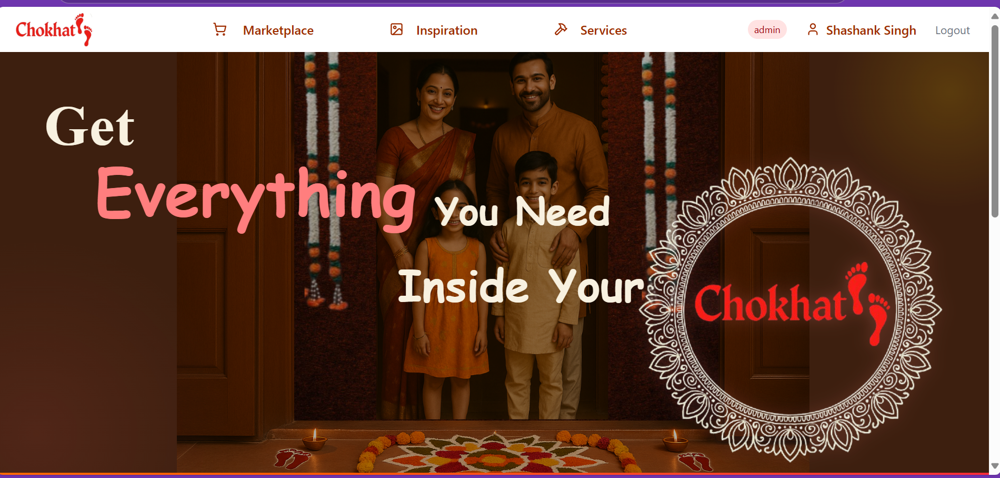
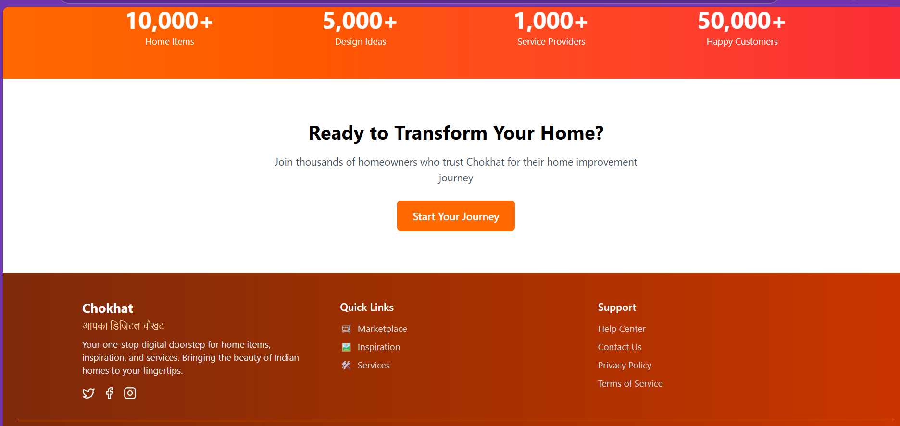

# 🏠 Chokhat - Full-Stack Marketplace [](https://opensource.org/licenses/MIT)

A complete e-commerce solution for home goods with multi-role access control and modern UI.

## ✨ Features
- **Role-Based Access Control** (User/Vendor/Admin)
- **JWT Authentication** 🔒
- **Dedicated Dashboards for Users, Vendors and Admin** 📦
- **Responsive UI** with Tailwind CSS

## 🛠 Tech Stack
| Frontend              | Backend               | Database        |
|-----------------------|-----------------------|-----------------|
| React.js              | Node.js (Express)     | MongoDB         |
| Tailwind CSS          | JWT Authentication    | 
|                       | REST API              |                 |

## Landing Page
  
 
## Marketplace
 
 

 

## 🚀 Installation

### Prerequisites
- Node.js v16+
- MongoDB Atlas account
- Stripe API keys

```bash
# Clone the repository
git clone https://github.com/yourusername/HomeEssentials.git
cd HomeEssentials
